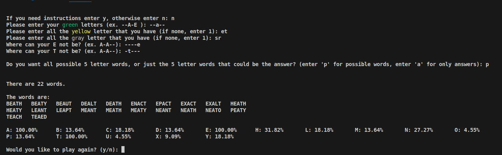

# WordleSolver
A way to help solve wordle when the word is being annoying.

## Includes

*   **common or uncommon words** gives the user the option to see all possible 5 letter words or just the possible wordle answers
*   **good instructions** easy and hopefully comprehendible instructions on where to input the different letters
*   **letter percentages** shows which letters are possibly in the words and what percentage of words they are in

## Installation 

*   To play you must have a Linux computer to download and run the pre-compiled executable. 

## How to download and run

1. *Download* Get the executable from the itch.io page (https://lilyec.itch.io/wordle-word-finder)

2. *Naviagte* Open the terminal and go to the directory you want to open it in

3. *Execute* Run the game with his command for Linux:
    ```bash
    .\solver
    ```

## How to use

*   More instructions shown in the program
*   Enter the green letters in their positions
*   Enter the yellow letter
*   Enter the gray letters
*   Enter the placements for the yellow letters
*   See the options




## Building from source

If you wish to compile the game yourself (perhaps to contribute or run on an unsupported platform), you will need a C++ compiler (like g++ testing but others will likely work).

1.  **Clone the Repository:**

2.  **Build the Game and launch:**
    
    i.e. source launch
    
